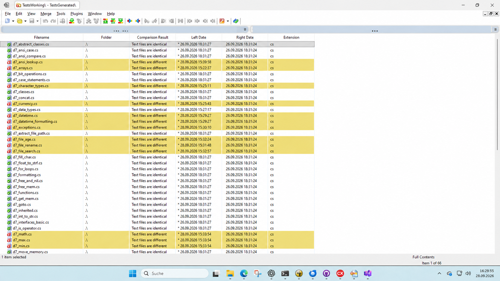

## Generated vs. manually corrected tests

The following WinMerge overview compares `TestsWorking` with
`TestsGenerated`. Identical files require no manual changes; highlighted
files currently contain manual corrections.

